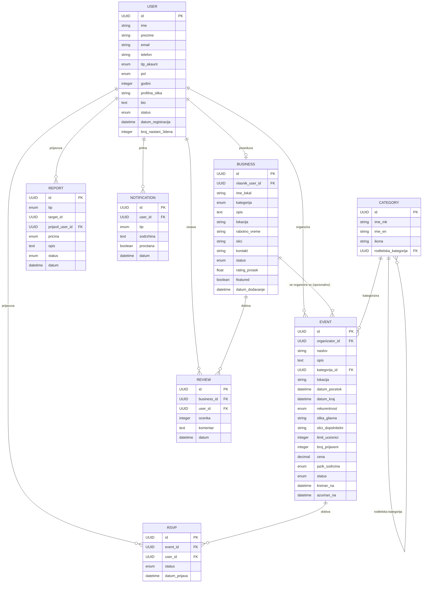

# План за апликација за локални настани — Iskoci

**Тип:** web и mobile апликација

---

## 0.0. Предлог имиња

- Mrdni
- Izlezi
- Iskoci
- MrdniSe
- SocialMkd
- Socijala
- Shema
- KadeEShemata

## 0.1. Предлог логоа и банери

_(да се додаде подоцна)_

---

## 1. Идеја и проблем

Во Скопје и останатите градови постојат многу настани и активности (забави, кафе шеми, коктели, турнири, натпревари, картинг, спортски повици и слично), но информациите за нив се расфрлани на разни Instagram профили од организатори. Не постои единствено место каде корисниците можат да ги следат сите овие случувања.

Целта на апликацијата е да биде централизирана платформа каде сите локални настани се објавуваат, категоризирани според интересите на корисникот, со можност и за пронаоѓање друштво за активности (пр. недостасуваат играчи за фудбал/кошарка/одбојка).

## 2. Основен концепт

Апликацијата е агрегатор и организатор на локални настани и активности, изградена околу три столба на содржина:

1. **Настани** — еднократни или повторливи случувања (забави, турнири, коктели, забавни вечери)
2. **Активности / повици за друштво** — некој бара играчи, учесници или друштво за нешто (фудбал, одбојка, картинг, веслање)
3. **Курирани листи** — препорачани кафичи/локации, потврдени од заедницата

## 3. Категории

Категориите се групирани во клучни секции наместо еден долг список:

- **Спорт и рекреација** — фудбал, кошарка, одбојка на плажа, картинг, веслање, турнири
- **Излегувања и забава** — вечерни забави, приватни журки, коктел вечери
- **Кафе култура** — кафе шеми/друштво за кафе + курирана листа на кафичи
- **Заедница / разно** — работилници, инфо-настани и друго

## 4. Клучни функционалности

### MVP (прва верзија)

- Feed на настани, филтриран по категорија, дата и локација
- Календарски приказ
- Детален приказ на настан (организатор, локација, време, слободни места)
- „Јас доаѓам" / RSVP + бројач на пријавени
- Основен профил на организатор
- Push нотификации за нови настани во избрани категории

### Фаза 2

- „Барам играч/и" огласи (фудбал, одбојка итн.) со брзо пополнување места
- Курирана листа на кафичи со рејтинг систем
- Следење (follow) на организатори/локации
- Споделување настан преку линк/сторис

### Фаза 3

- Билетирање/плаќање in-app за платени настани
- Организаторски dashboard со статистики
- Chat/коментари под настан

## 5. Информациска архитектура (навигација)

Предлог за долно мени (bottom nav) на мобилната апликација:

- **Дома / Feed** — персонализиран фийд според избрани категории
- **Пребарај / Категории** — структуриран приказ по категорија
- **Календар** — датумски преглед
- **Барам друштво** — посебен таб за повици за учесници/играчи
- **Профил** — твои настани, зачувани, следени организатори

## 6. Додавање настан

Јасен пат за корисниците кои објавуваат содржина:

- Верификација на организатор (email + телефон)
- Опција „рекурентен настан" (пр. секој вторник кафе шема)

### Форма за додавање настан — полиња

- Наслов на настанот
- Категорија (спорт, излегување, кафе култура, заедница...)
- Локација (мапа pin + адреса/име на локал)
- Датум и време (со опција за повторливост)
- Опис / детали
- Слики (една или повеќе)
- Лимит на луѓе / слободни места (опционално)
- Цена / бесплатно (опционално, за подоцна)
- Контакт информации на организаторот (видливи или скриени, по избор)

### Чекори при објавување

1. Пополнување форма
2. Автоматска проверка на лимит (3 настани / 3 дена)
3. Објавување во feed
4. Admin надзор + можност за report од корисници

## 7. Промоција на кафици / локали / угостителски објекти

Покрај настаните, апликацијата вклучува и посебен дел за промоција на угостителски објекти (кафици, барови, ресторани) — курирана листа која им помага на корисниците да најдат добри локации, а на локалите да се промовираат кај релевантна публика.

### Како функционира

- Секој локал добива свој профил/страница во апликацијата (име, локација, слики, работно време, тип на понуда)
- Локалите можат самите да аплицираат за да бидат додадени, или корисниците да ги предложат (со проверка од admin пред да се објават)
- „Одобрено" / верификуван бедж — локали кои имаат добри искуства/препораки од заедницата се одвојуваат визуелно во листата
- Локалите можат да објавуваат и свои настани директно (пр. кафе шема, коктел вечер, happy hour) преку истата форма за настани

### Монетизациски потенцијал (за подоцна)

- Платена промоција / featured позиција во листата на кафици
- Платени банери или истакнати картички во категоријата „Кафе култура"
- Партнерски договори со локали за приоритетен приказ

## 8. Јазик / Локализација

Апликацијата ќе биде двојазична — македонски и англиски.

- Стандарден јазик според поставки на уредот, со рачна опција за промена во апликацијата
- Целата содржина што ја внесуваат корисниците (наслови на настани, опис) останува во јазикот на кој е внесена — не се преведува автоматски во MVP фаза
- Системски елементи (мениа, копчиња, нотификации, форми) се целосно преведени на двата јазика
- **Идна опција (подоцна):** автоматски превод на описи преку API, за да странски посетители/туристи во Скопје исто така можат да ја користат апликацијата

## 9. Верификација и trust систем

Целта на апликацијата е да биде привлечна за корисниците и лесна за преземање и користење, затоа верификацијата е наменски едноставна — без лични документи.

### При регистрација

- Email + телефонски број верификација (OTP)
- Тоа е доволно акаунтот да се смета за верификуван

### Лимит на објавување

- 3 настани во тек на 3 дена по верифициран акаунт
- Rolling window од 72 часа (не calendar-based) — системот автоматски следи колку настани се објавени во последните 3 дена

### Модерација

- Admin (рачен) надзор — прегледување нови настани/огласи и бришење ако нешто не е во ред (несоодветна содржина, спам, лажни настани)
- Report копче — секој корисник може да пријави настан/оглас, што оди директно до admin за преглед
- Нема автоматски penalty систем на почеток — admin рачно одлучува за секој случај (бришење, предупредување, суспензија)

### Преглед на trust системот

| Чекор | Барање | Забелешка |
|---|---|---|
| Регистрација | Email + телефонски број (OTP) | Без документи за лична идентификација |
| Објавување настан / повик за друштво | Само верифициран акаунт | Достапно веднаш по верификација |
| Лимит на објавување | 3 настани / 3 дена | Rolling window (последните 72ч) |
| Модерација | Рачна (admin) + report копче | Admin ја следи содржината и одлучува |
| Казна / акција | По одлука на admin | Бришење настан, предупредување или суспензија |

## 10. Admin панел — потребни функции

- Листа на сите нови настани (хронолошки), со брзо копче Approve / Delete
- Листа на пријавени (reported) содржини со причина за пријавата
- Преглед на корисници и нивна историја (број објавени настани, пријави)

## 11. Доверба и модерација — резиме

- Верификувани акаунти преку email + телефон
- Report опција достапна на секој настан/оглас
- Admin рачно одлучува за отстранување содржина или казна

## 12. Монетизација (за подоцна)

- Featured / промовирани настани за организатори
- Билетирање со провизија
- Партнерства со кафичи/локации (платен приоритет во листата)

## 13. Целосен Data Модел

Подолу е целосниот data модел на апликацијата — сите главни ентитети (табели), нивните полиња и релациите меѓу нив.

### USER

| Поле | Тип | Опис |
|---|---|---|
| id | UUID | Уникатен идентификатор (PK) |
| ime, prezime | string | Име и презиме |
| email | string | Верификуван преку OTP |
| telefon | string | Верификуван преку OTP |
| tip_akaunt | enum | regular / business / admin |
| pol | enum, nullable | masko / zensko — задолжително само за regular акаунт; null за business |
| godini | integer | Само за regular акаунт |
| profilna_slika | string (URL) | Ако не постави своја слика, автоматски се генерира default аватар според полот (за regular); за business се користи лого/слика на локалот |
| bio | text, nullable | Кратка забелешка / опис на профилот |
| status | enum | verificiran / flagged / suspendiran |
| datum_registracija | datetime | |
| broj_nastani_3dena | integer (derived) | За rolling limit проверка (3 настани / 3 дена) |

### BUSINESS

| Поле | Тип | Опис |
|---|---|---|
| id | UUID | PK |
| sopstvenik_user_id | UUID (FK → User) | Сопственик на бизнис профилот |
| ime_biznis | string | |
| kategorija | enum | кафе / бар / ресторан |
| opis | text | |
| lokacija | string / geo | Адреса + pin на мапа |
| rabotno_vreme | string / JSON | По денови |
| fotografii | string (URL[]) | |
| kontakt | string / JSON | телефон, Instagram, website |
| status | enum | na_cekanje / verificiran |
| rating_prosek | float (derived) | Пресметан од Review табелата |
| featured | boolean | Платена промоција |
| datum_dodavanje | datetime | |

### EVENT (настан)

| Поле | Тип | Опис |
|---|---|---|
| id | UUID | PK |
| organizator_id | UUID (FK → User) | Секогаш покажува кон User — видете ја забелешката подолу |
| naslov | string | |
| opis | text | |
| kategorija_id | UUID (FK → Category) | |
| lokacija | string / geo | Адреса; опционално содржи и business_id ако настанот е во конкретен локал |
| datum_pocetok, datum_kraj | datetime | |
| rekurentnost | enum + rule | none / weekly / custom |
| slika_glavna, slici_dopolnitelni | string (URL[]) | |
| limit_ucesnici | integer, nullable | |
| broj_prijaveni | integer (derived) | Пресметан од RSVP табелата |
| cena | decimal, nullable | 0 или null = бесплатно |
| jazik_sodrzina | enum | mk / en / both |
| status | enum | na_cekanje / objaven / izbrisan / istekol |
| kreiran_na, azuriran_na | datetime | |

### CATEGORY

| Поле | Тип | Опис |
|---|---|---|
| id | UUID | PK |
| ime_mk, ime_en | string | Двојазичен назив |
| ikona | string | |
| roditelska_kategorija | UUID (FK → Category), nullable | За групирање во под-категории (пр. Спорт → Фудбал) |

### RSVP (пријава за настан)

| Поле | Тип | Опис |
|---|---|---|
| id | UUID | PK |
| event_id | UUID (FK → Event) | |
| user_id | UUID (FK → User) | |
| status | enum | doagam / mozhebi / otkazano |
| datum_prijava | datetime | |

### REPORT (пријава за несоодветна содржина)

| Поле | Тип | Опис |
|---|---|---|
| id | UUID | PK |
| tip | enum | event / business / user |
| target_id | UUID | Полиморфна врска — цели кон Event, Business или User во зависност од tip |
| prijavil_user_id | UUID (FK → User) | |
| pricina | enum | spam / neprikladno / lazen nastan / drugo |
| opis | text, nullable | |
| status | enum | na_cekanje / reshen / otfrlen |
| datum | datetime | |

### REVIEW (оцена на локал)

| Поле | Тип | Опис |
|---|---|---|
| id | UUID | PK |
| business_id | UUID (FK → Business) | |
| user_id | UUID (FK → User) | |
| ocenka | integer (1–5) | |
| komentar | text, nullable | |
| datum | datetime | |

### NOTIFICATION

| Поле | Тип | Опис |
|---|---|---|
| id | UUID | PK |
| user_id | UUID (FK → User) | |
| tip | enum | nov_nastan / potvrda / report_update |
| sodrzhina | text | |
| procitana | boolean | |
| datum | datetime | |

### ER дијаграм (Mermaid)

### Важна забелешка — `organizator_id` во EVENT

⚠ На дијаграмот погоре стои концептуална врска „организира" и од USER и од BUSINESS кон EVENT.

Логички, полето `organizator_id` во EVENT не може истовремено да биде FK кон две различни табели (User и Business). Решението е `organizator_id` секогаш да покажува кон **USER** — бидејќи секој Business веќе има свое поле `vlasnik_user_id`, па кога бизнис профил организира настан, тоа реално се прави преку поврзаниот кориснички акаунт на сопственикот.

Врската „организира" од BUSINESS кон EVENT затоа треба да се чита како **индиректна** (преку User), а не како посебна физичка FK колона. Доколку настанот се случува во конкретен локал, тоа се бележи одделно преку полето `business_id` во `lokacija` на EVENT, не преку `organizator_id`.

### Клучни релации — резиме

- User 1—N Event (како организатор)
- User 1—1 Business (сопственик преку `vlasnik_user_id`)
- Business 1—N Event (индиректно, преку организаторот-сопственик)
- Event 1—N RSVP, RSVP N—1 User
- Business 1—N Review, Review N—1 User
- Category 1—N Event
- Category 1—N Category (само-релација за под-категории)
- User/Event/Business 1—N Report (полиморфно, преку `tip` + `target_id`)
- User 1—N Notification

## 14. Следни чекори

- Wireframe / mockup на главните екрани (feed, детали на настан, „барам играч" таб, форма за објавување) — UX/UI
- User flow дијаграм за целосното патување на корисникот
